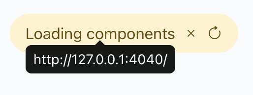

# every canvas

Connect your canvas to the open web.


[everyone](https://near.social/mob.near/widget/Everyone) [builds](https://www.nearbuilders.org/) [everything](https://www.merriam-webster.com/dictionary/everything) [together](https://near.social).


# Context

[Sawyer Hood](https://github.com/SawyerHood) built [an app](https://github.com/SawyerHood/draw-a-ui) that uses tldraw and the [gpt-4-vision](https://openai.com/blog/new-models-and-developer-products-announced-at-devday) api to generate html based on a wireframe you draw.

[tldraw forked that app](https://github.com/tldraw/draw-a-ui), then [I forked tldraw](https://github.com/tldraw/draw-a-ui).

I had originally adapted the prompt and preview shape to create [near.social](https://near.social) widgets and embed them via [near-bos-webcomponent](https://github.com/petersalomonsen/near-bos-webcomponent). I was able to create valid, stateful widget code:


It worked by taking the current canvas SVG, converting it to a PNG, and then sending that png to gpt-4-vision with instructions to return a single jsx file with styled components. The JSX code was then passed to a [near-bos-webcomponent](https://github.com/petersalomonsen/near-bos-webcomponent) so it could be rendered via the Near Social VM](https://github.com/NearSocial/VM), but now I'm  thinking there should be a widget with an iframe inside it -- then this iframe holds the html that gets generated from the canvas. Possibly sharing some resemblance with [bos-web-engine](https://github.com/near/bos-web-engine/blob/main/architecture.md#trust).


# Overview

This repository is built using the [NEAR open web stack](https://near.org/learn). 

Right now, it is a [Near Social gateway](https://github.com/NearSocial/viewer) and [bos-workspace](https://github.com/nearbuilders/bos-workspace) combined in one. This gateway provides [tldraw](https://tldraw.dev/) as a custom element to the [Near Social VM](https://github.com/NearSocial/VM). This enables us to use ```<Tldraw />``` and it's [editor](./src/components/custom/tldraw/Canvas.js) via:
```javascript
<Canvas
  initialSnapshot={data || {}}
  persistance={path}
  autoFocus={true}
/>
```

in a widget you can find in [apps/canvas/widget/index](./apps/canvas/widget/index.jsx). [Widgets](https://thewiki.near.page/near.social_widgets) are reusable composable components for Near Social. You can view and create widgets at [near.social](https://near.social). 

This means the [draw.everything.dev](https://draw.everything.dev) gateway provides you with the ability to hack your own components using the ```<Canvas>``` element.

This structure will evolve for a better development experience.


## Setup & Development

Initialize repo:
```
yarn
```

Start development version:
```
yarn dev
```

This will start both the gateway at localhost:3000 and serve the widgets from http://127.0.0.1:4040.

Once these are running, copy this server address (http://127.0.0.1:4040), go to [localhost:3000/flags](http://localhost:3000/flags) (Chrome recommended), and paste it as the BOS Loader Url.

Save and you should see the following banner:



### Next Steps

- [x] Merge [PR to near-bos-webcomponent](https://github.com/petersalomonsen/near-bos-webcomponent/pull/1) and replace bundles from CDN
- [x] Ability to publish JSX widget to the [social-db](https://github.com/NearSocial/social-db)
- [ ] Load in existing widgets and make modifications to them
- [x] Option to provide your own API key ([near-openai](https://github.com/petersalomonsen/near-openai))
- [ ] Feature to provide custom prompts and option to swap chat gpt model - IN DEV
- [ ] Store JSON on IPFS and create [hyperfiles](https://github.com/hyperfiles-org/hyperfiles) for saving canvas and communicating with [Obsidian](https://docs.obsidian.md/Plugins/Getting+started/Build+a+plugin).
- [ ] Deploy to [web4](https://github.com/vgrichina/web4)


## Contributing

Pull requests are welcome! Happy hacking!

If you'd like to help improve the developer experience, help out [here](https://github.com/orgs/NEARBuilders/projects/5).
